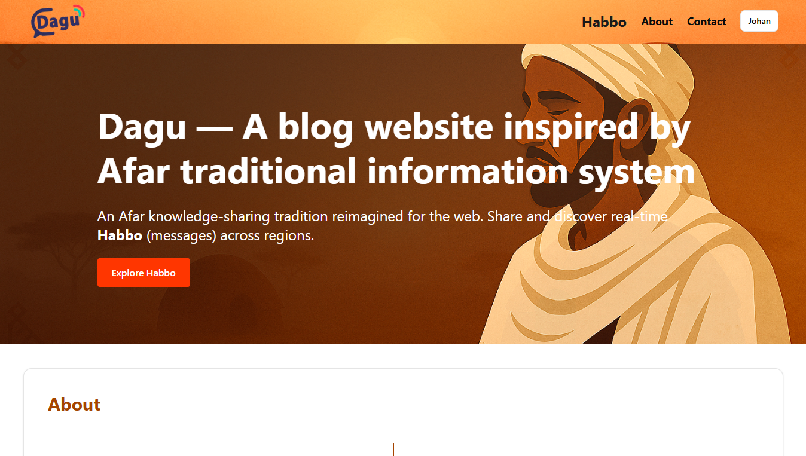

# Dagu 🌍

**A Modern Web Platform Inspired by the Afar People's Traditional Information System**

> _This is a submission for the [Storyblok Challenge](https://dev.to/challenges/storyblok)_

---

## 📖 Overview

**Dagu** is a modern web platform that brings the ancient Afar communication tradition into the digital age. The Afar people of Ethiopia have long relied on **Dagu**, a system of real-time, trusted verbal news sharing. This project revives that spirit by creating a digital space where users can create, share, and engage with valuable community knowledge — called **Habbos**.

The project was built for the Storyblok Challenge to demonstrate how traditional storytelling can thrive on modern headless CMS architecture with a touch of AI.

---

## 🚀 Live Demo

- 🔗 **Website:** [https://dagu.vercel.app](https://dagu.vercel.app)  
- 🔗 **Storyblok Space:** [https://sylfxxcladepgakbnsin.supabase.co](https://sylfxxcladepgakbnsin.supabase.co)
- 🔗 **GitHub Repo:** [https://github.com/Abualiy/dagu](https://github.com/Abualiy/dagu)

---

## 🛠️ Tech Stack

- **Frontend:** Next.js 14 App Router (TypeScript)
- **CMS:** Storyblok (Visual Editor, Components, Management API)
- **Authentication:** Supabase Auth
- **Styling:** Tailwind CSS
- **Icons & UI:** Lucide, shadcn/ui
- **Hosting:** Vercel

---

## 🤖 AI Integration

Used OpenRouter AI API to enhance the blog creation experience:

- ✨ **Excerpt Generation:** AI automatically creates 2–3 sentence summaries from the post content.
- ✍️ **Text Improvement:** Users can enhance or refine their blog content before publishing.

---

## 📸 Screenshots

---

## 🧠 What I Learned

- Leveraged Storyblok's visual editor and component-based architecture to create reusable content blocks.
- Integrated Supabase for secure authentication and session handling.
- Connected OpenRouter AI API for real-time excerpt generation and text improvement.
- Improved my understanding of dynamic content fetching and real-time updates with Storyblok.

---

## 🧑‍🤝‍🧑 Team

Built with ❤️ by [@Abualiy](https://akremmuktar.vercel.app)

